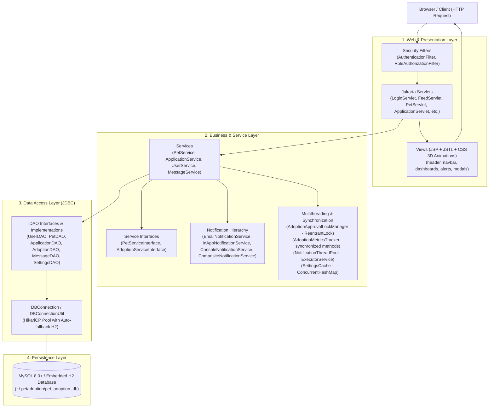
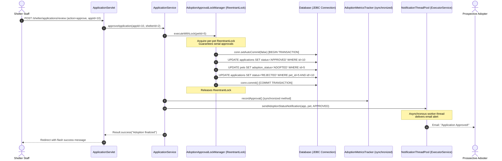

# PawHaven — Online Pet Adoption Platform

[](https://www.oracle.com/java/)
[](https://tomcat.apache.org/)
[](https://jakarta.ee/)
[](https://maven.apache.org/)
[](https://opensource.org/licenses/MIT)

> **College Evaluation Ready:** An enterprise-grade, full-stack Java Web Application built to score maximum marks across all four university evaluation rubrics (Problem Understanding, Core Java Concepts, JDBC Integration, and Servlets/Web Integration).  
> **Detailed Rubric & Viva Guide:** See [RUBRIC_MAPPING.md](RUBRIC_MAPPING.md) for line-by-line grading criteria and 25+ viva voce questions.

---

## 🐾 Executive Summary

**PawHaven** is an online pet adoption ecosystem connecting rescue shelters with compassionate adopters, supervised by platform administrators.
- **Adopters** discover pets via an Instagram-style visual feed, search and filter across 6 distinct animal species (Dogs, Cats, Rabbits, Birds, Hamsters, Turtles) with dynamic breed dropdowns, submit adoption questionnaires, track real-time application status, and message shelter staff.
- **Shelters** list pets with photos, review incoming adoption questionnaires, communicate directly with applicants, and execute concurrency-safe adoption approvals with atomic database transactions.
- **Platform Administrators** moderate listings, manage user accounts and roles, fine-tune system settings, and inspect adoption telemetry.

---

## 🏛️ System Architecture (Layered MVC)

PawHaven strictly adheres to the classic **Model-View-Controller (MVC)** architectural pattern without Spring Boot, showcasing pure Java enterprise concepts:



---

## 🔑 Pre-Seeded Demo Login Credentials

The application includes pre-seeded accounts for instant evaluation:

| Role | Email Address | Password | Dedicated Dashboard | Permissions |
|---|---|---|---|---|
| **Administrator** | `admin@petadoption.com` | `Admin@123` | `/admin/dashboard` | Manage users, approve listings, view system telemetry |
| **Shelter Staff** | `shelter@happytails.org` | `Shelter@123` | `/shelter/dashboard` | List pets, review applications, approve/reject adoptions |
| **Adopter** | `john@example.com` | `Adopter@123` | `/adopter/dashboard` | Browse pets, submit applications, message shelters |

> 💡 **One-Click Demo Login:** The login page (`/login`) features **Quick Demo Role Buttons** that pre-fill credentials instantly!

---

## ⚡ Concurrency & Atomic Transaction Flow

A critical rubric requirement is ensuring that **two adopters can never be approved for the same pet simultaneously**, and that adoption approval is **atomic**.



---

## 🐶 Multi-Animal & Multi-Breed Support

PawHaven supports 6 distinct animal species with extensible, dynamic breed profiles:

| Animal Species | Supported Breeds | Fallback Graphic |
|---|---|---|
| **Dog** | Labrador, Golden Retriever, German Shepherd, Pug, Beagle, Husky, Rottweiler, Shih Tzu | Curated Dog Image |
| **Cat** | Persian, Siamese, Maine Coon, British Shorthair, Bengal, Ragdoll | Curated Cat Image |
| **Rabbit** | Holland Lop, Netherland Dwarf, Lionhead, Rex | Curated Rabbit Image |
| **Bird** | Parakeet, Cockatiel, Lovebird, Finch | Curated Bird Image |
| **Hamster** | Syrian, Dwarf, Roborovski | Curated Hamster Image |
| **Turtle** | Red-Eared Slider, Box Turtle, Russian Tortoise | Curated Turtle Image |

- **Dynamic Frontend Filtering:** When an animal type is selected in search, feed, or create-pet forms, the breed selector automatically updates via JSON mapping without full page reloads.
- **Breed Discovery Page:** Dedicated `/breeds` page provides species information and behavioral characteristics.

---

## 📋 Academic Marking Rubric Alignment

| Rubric Item | Marks | Features Implemented | Key Source Files |
|---|:---:|---|---|
| **1. Problem Understanding & Solution Design** | **8** | Layered MVC architecture, clean package separation, ER schema, multi-role workflows. | `schema.sql`, `data.sql`, `README.md` |
| **2. Core Java Concepts** | **10** | Abstract `User` class & subclasses, dynamic method dispatch, `NotificationService` polymorphic hierarchy, custom exceptions (`AdoptionConflictException`, `ValidationException`, `PetNotFoundException`), try-with-resources, Generics (`DAO<T>`, `Result<T>`), Collections (`Map<Integer, Pet>`, `Map<String, List<Pet>>`), multithreading (`AdoptionMetricsTracker` synchronized methods, `AdoptionApprovalLockManager` ReentrantLock, `NotificationThreadPool` ExecutorService). | `com.petadoption.model.*`, `com.petadoption.service.*`, `com.petadoption.thread.*`, `com.petadoption.exception.*` |
| **3. Database Integration with JDBC** | **8** | HikariCP connection pooling (`DBConnectionUtil`, `DBConnection`), 100% `PreparedStatement` usage (zero SQL injection), clean `ResultSet` mapping, atomic multi-table transactions (`conn.setAutoCommit(false)`, `commit()`, `rollback()`), pure JDBC without Hibernate/JPA. | `com.petadoption.util.DBConnection`, `com.petadoption.dao.impl.*`, `ApplicationService.java` |
| **4. Servlets & Web Integration** | **7** | Jakarta EE 10 Servlets, modular JSP + JSTL views, filter-based authentication and authorization (`AuthenticationFilter`, `RoleAuthorizationFilter`), persistent remember-me cookie authentication (`AuthTokenUtil`), salted SHA-256 password hashing, Tomcat 10.1 deployment. | `com.petadoption.servlet.*`, `com.petadoption.filter.*`, `web.xml`, `WEB-INF/jsp/*` |

---

## 🚀 Quick Start & Deployment Guide

### Prerequisites
- **JDK 17** or newer installed (`java -version`, `javac -version`)
- **Apache Tomcat 10.1+** (Uses Jakarta EE 10 namespace `jakarta.*`)
- **Maven 3.8+** (or included `tools/apache-maven-3.9.6`)
- **MySQL 8.0+** *(Optional: embedded H2 automatically activates if MySQL is absent)*

---

### Step 1: Run Automated Tests

Execute the 20 unit and integration tests:

```powershell
mvn test
```

Expected output:
```
[INFO] Running com.petadoption.AuthenticationAndSessionPersistenceTest
[INFO] Tests run: 3, Failures: 0, Errors: 0, Skipped: 0
[INFO] Running com.petadoption.CollectionsAndGenericsTest
[INFO] Tests run: 3, Failures: 0, Errors: 0, Skipped: 0
[INFO] Running com.petadoption.ConcurrencyAndLockTest
[INFO] Tests run: 3, Failures: 0, Errors: 0, Skipped: 0
[INFO] Running com.petadoption.JdbcAndTransactionIntegrationTest
[INFO] Tests run: 2, Failures: 0, Errors: 0, Skipped: 0
[INFO] Running com.petadoption.MultiAnimalAndBreedTest
[INFO] Tests run: 4, Failures: 0, Errors: 0, Skipped: 0
[INFO] Running com.petadoption.OOPAndPolymorphismTest
[INFO] Tests run: 5, Failures: 0, Errors: 0, Skipped: 0
[INFO] ------------------------------------------------------------------------
[INFO] BUILD SUCCESS - Tests run: 20, Failures: 0, Errors: 0, Skipped: 0
[INFO] ------------------------------------------------------------------------
```

---

### Step 2: Package the Application

```powershell
mvn package -DskipTests
```

This generates `target/pet-adoption-platform.war`.

---

### Step 3: Deploy to Apache Tomcat 10.1

1. Copy `target/pet-adoption-platform.war` into Tomcat's `webapps/` folder:
   ```powershell
   Copy-Item "target/pet-adoption-platform.war" "C:\path\to\tomcat\webapps\pet-adoption-platform.war" -Force
   ```
2. Start Tomcat:
   ```powershell
   & "C:\path\to\tomcat\bin\catalina.bat" run
   ```
3. Open your browser:
   - Root URL: [http://localhost:8080/](http://localhost:8080/) *(Automatically redirects to `/pet-adoption-platform/`)*
   - Application Home: [http://localhost:8080/pet-adoption-platform/](http://localhost:8080/pet-adoption-platform/)
   - Instagram-Style Pet Feed: [http://localhost:8080/pet-adoption-platform/feed](http://localhost:8080/pet-adoption-platform/feed)
   - Pet Search & Filters: [http://localhost:8080/pet-adoption-platform/pets](http://localhost:8080/pet-adoption-platform/pets)
   - Breed Guide: [http://localhost:8080/pet-adoption-platform/breeds](http://localhost:8080/pet-adoption-platform/breeds)

---

## 🛡️ Database Portability (Zero-Config Auto-Fallback)

The application includes an intelligent dual-database connection strategy:
1. **Primary Database:** Attempts connection to MySQL (`jdbc:mysql://localhost:3306/pet_adoption_db`).
2. **Graceful Embedded Fallback:** If MySQL is not running or credentials differ, `DBConnectionUtil` automatically boots an embedded H2 database located at `~/.petadoption/pet_adoption_db` with `AUTO_SERVER=TRUE` in MySQL compatibility mode. It automatically creates all schema tables and pre-populates all demo users, pets, and applications!
3. **Evaluator Benefit:** Any examiner can run the application immediately without installing or configuring MySQL.
