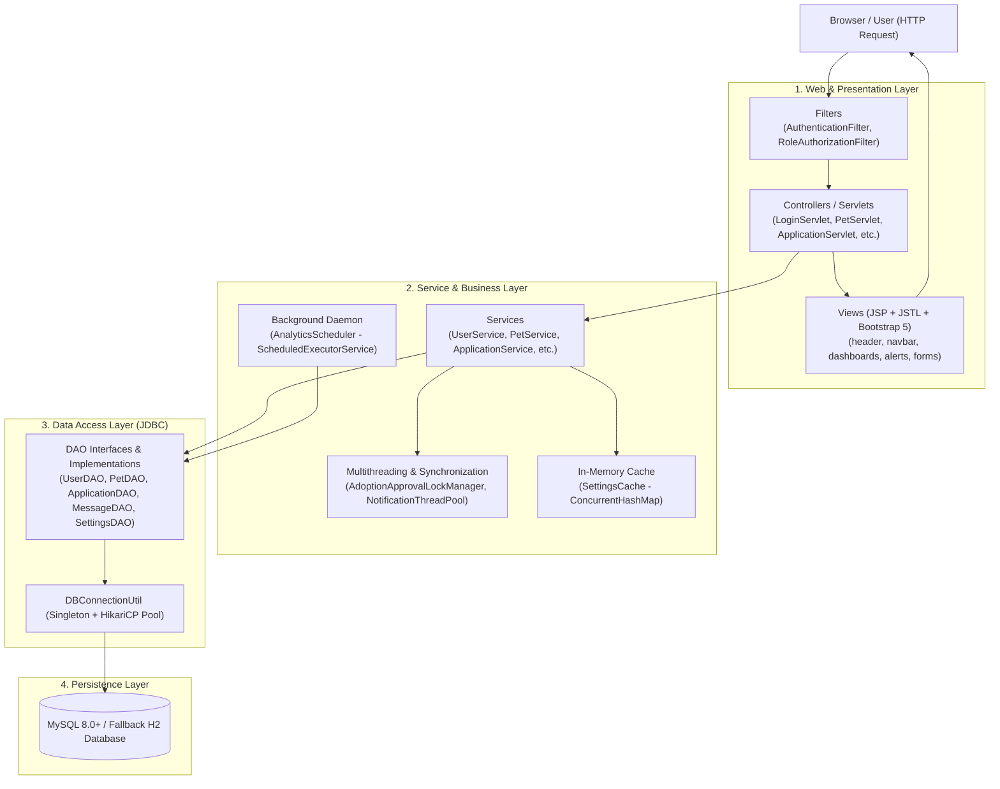
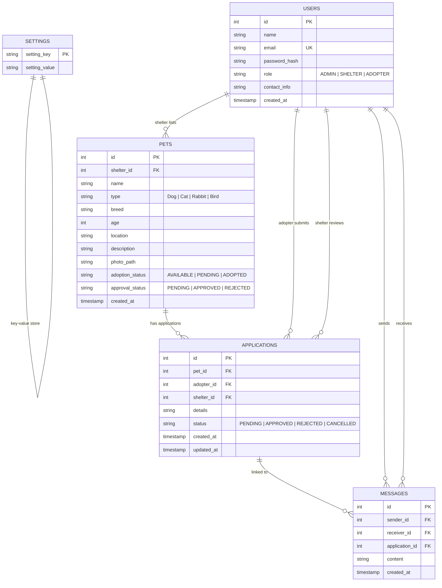
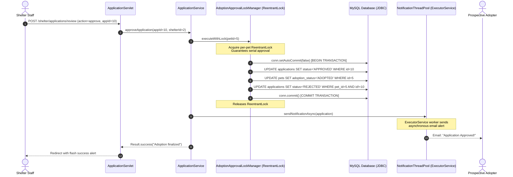

# PawHaven — Online Pet Adoption Platform

A full-stack, enterprise-grade Java Web Application built to score maximum marks across all four items of the academic marking rubric:

1. **Problem Understanding & Solution Design (8 marks)**
2. **Core Java Concepts (10 marks)**
3. **Database Integration with JDBC (8 marks)**
4. **Servlets & Web Integration (7 marks)**

---

## 🐾 Executive Summary

**PawHaven** is an online pet adoption ecosystem connecting rescue shelters with compassionate adopters, overseen by platform administrators.
- **Shelters** list pets with photos, review incoming adoption questionnaires, communicate directly with applicants, and manage adoption decisions.
- **Adopters** search and filter pets by species, breed, location, and age, submit adoption applications, track application decisions in real time, and chat with shelters.
- **Admins** review and verify new shelter listings, manage user roles and accounts, fine-tune platform-wide configuration settings, and monitor adoption telemetry.

---

## 🏛️ System Architecture (Layered MVC)

The application adheres strictly to the classic **Model-View-Controller (MVC)** layered architectural pattern, with clear separation of concerns across well-defined packages:



---

## 📊 Database Entity-Relationship (ER) Diagram



---

## ⚡ Concurrency & Atomic Transaction Flow

A critical requirement in Rubric Items 2 & 3 is ensuring that **two adopters can never be approved for the same pet simultaneously**, and that adoption approval is **atomic**.



---

## 📋 Comprehensive Rubric Mapping

This table maps every single requirement in the evaluation rubric directly to its implementation class and file location.

| Rubric Category | Specific Rubric Requirement | Implementation Class / File | Description |
|---|---|---|---|
| **1. Problem Understanding & Solution Design (8 Marks)** | Layered MVC Architecture | `com.petadoption.servlet.*`<br>`com.petadoption.service.*`<br>`com.petadoption.dao.*`<br>`WEB-INF/jsp/*` | Strict separation of Views (JSP/JSTL), Controllers (Servlets), Services (Business Rules), DAOs (Data Access), and Domain Models. |
| | Well-organized packages | `com.petadoption.[model, dao, service, servlet, filter, exception, util, thread]` | Clean, cohesive packaging structure adhering to standard Java conventions. |
| | Documented ER diagram & flows | `README.md` & `schema.sql` | Mermaid ER diagram, sequence diagrams, and foreign key / index schemas. |
| **2. Core Java Concepts (10 Marks)** | Abstract class `User` & Subclasses | `com.petadoption.model.User`<br>`com.petadoption.model.Admin`<br>`com.petadoption.model.Shelter`<br>`com.petadoption.model.Adopter` | Abstract base class with inheritance, encapsulated fields, and polymorphic methods `getDashboardPath()` and `getPermissions()`. |
| | Polymorphism | `User.getDashboardPath()`<br>`User.getPermissions()` | Dynamic method dispatch routes each user type to their dashboard and enforces distinct role permissions. |
| | Interfaces | `com.petadoption.model.Notifiable`<br>`com.petadoption.model.Searchable`<br>`com.petadoption.dao.DAO<T>` | Decoupled contracts implemented across entities for notification dispatch, text/attribute filtering, and data access. |
| | Custom Exception Handling | `com.petadoption.exception.PetNotFoundException`<br>`com.petadoption.exception.ApplicationAlreadyExistsException`<br>`com.petadoption.exception.InvalidCredentialsException`<br>`com.petadoption.exception.ValidationException`<br>`com.petadoption.exception.DatabaseException` | Checked and unchecked custom exceptions with meaningful context; handled in servlets and forwarded to custom error pages. |
| | Try-with-resources | All DAO implementations in `com.petadoption.dao.impl.*` | Guaranteed closure of `Connection`, `PreparedStatement`, and `ResultSet` without resource leaks. |
| | Global Error Pages | `WEB-INF/jsp/error/404.jsp`<br>`WEB-INF/jsp/error/500.jsp`<br>`WEB-INF/jsp/error/error.jsp`<br>`web.xml` | Configured in `web.xml` to trap HTTP 404, 500, and generic `java.lang.Throwable`. |
| | Generic `DAO<T>` Interface | `com.petadoption.dao.DAO<T>` | Standardized CRUD contracts: `findById`, `findAll`, `save`, `update`, `deleteById`. |
| | Generic `Result<T>` Wrapper | `com.petadoption.util.Result<T>` | Reusable result wrapper capturing status, descriptive message, payload, and timestamps. |
| | Collections & Streams | `com.petadoption.util.PetComparator`<br>`com.petadoption.service.PetService` | `Set<String>` for role permissions, `Map<String, String>` for settings, `List<T>` for collections, Java Stream API for filtering and sorting. |
| | Concurrency: Async Worker Pool | `com.petadoption.thread.NotificationThreadPool` | `ExecutorService` thread pool executing non-blocking adopter notification tasks with custom ThreadFactory and audit log. |
| | Concurrency: Double-Approval Prevention | `com.petadoption.thread.AdoptionApprovalLockManager` | Fair `ReentrantLock` keyed per `petId` preventing race conditions where multiple requests attempt to approve different adopters simultaneously. |
| | Concurrency: Thread-Safe Cache | `com.petadoption.thread.SettingsCache` | `ConcurrentHashMap` key-value cache preventing repetitive DB lookups with atomic `computeIfAbsent`. |
| | Concurrency: Scheduled Task | `com.petadoption.thread.AnalyticsScheduler` | `ScheduledExecutorService` calculating and caching platform statistics periodically in the background. |
| **3. Database Integration with JDBC (8 Marks)** | Connection Pool Singleton | `com.petadoption.util.DBConnectionUtil` | Thread-safe Singleton reading from `db.properties`, initializing HikariCP pool with automatic embedded H2 fallback. |
| | Plain JDBC (No Hibernate/JPA) | `com.petadoption.dao.impl.*` | Pure standard JDBC using `java.sql.*`. |
| | PreparedStatement Everywhere | All DAO implementations | 100% parameter binding on every query to eliminate SQL Injection risks. |
| | Clean ResultSet Mapping | `UserDAOImpl.mapResultSetToUser`<br>`PetDAOImpl.mapResultSetToPet`<br>`ApplicationDAOImpl.mapResultSetToApplication`<br>`MessageDAOImpl.mapResultSetToMessage` | Encapsulated mapping logic converting JDBC rows into rich domain POJOs. |
| | ACID Transactions | `ApplicationService.approveApplication` | Explicit `conn.setAutoCommit(false)`, multi-table updates (`applications` + `pets`), `conn.commit()`, and `conn.rollback()` in `catch`. |
| **4. Servlets & Web Integration (7 Marks)** | Servlets (10 Controllers) | `LoginServlet`<br>`RegisterServlet`<br>`LogoutServlet`<br>`HomeServlet`<br>`SearchServlet`<br>`PetDetailsServlet`<br>`UserServlet`<br>`PetServlet`<br>`ApplicationServlet`<br>`MessageServlet`<br>`SettingsServlet`<br>`AnalyticsServlet` | Jakarta EE 10 / Tomcat 10 compatible servlets managing HTTP request/response flow. |
| | Role Dashboards & JSP Views | `WEB-INF/jsp/admin/*`<br>`WEB-INF/jsp/shelter/*`<br>`WEB-INF/jsp/adopter/*`<br>`WEB-INF/jsp/pet/*` | Responsive Bootstrap 5 user interfaces with JSTL tag libraries (`<c:forEach>`, `<c:if>`, `<c:choose>`). |
| | Sessions & Password Hashing | `com.petadoption.util.PasswordUtil`<br>`LoginServlet` | Cryptographically salted SHA-256 password hashing; 30-minute HTTP session management. |
| | Security Filters | `com.petadoption.filter.AuthenticationFilter`<br>`com.petadoption.filter.RoleAuthorizationFilter` | Declarative URL protection enforcing active sessions and Role-Based Access Control (`/admin/*`, `/shelter/*`, `/adopter/*`). |
| | Multipart Photo Upload | `PetServlet` (`@MultipartConfig`) | Handles multipart file upload for pet photos, saving unique UUID files to `uploads/` directory. |
| | Flash Messaging & Feedback | `BaseServlet`<br>`alerts.jsp` | Session-backed flash alerts (`flashSuccess`, `flashError`) automatically displayed and dismissed. |

---

## 🔑 Default Login Credentials

The database is pre-seeded with accounts for all three user roles:

| Role | Email Address | Password | Dedicated Dashboard URL |
|---|---|---|---|
| **Administrator** | `admin@petadoption.com` | `admin123` | `/admin/dashboard` |
| **Shelter 1** | `shelter@happytails.org` | `shelter123` | `/shelter/dashboard` |
| **Shelter 2** | `contact@pawsandclaws.org` | `shelter123` | `/shelter/dashboard` |
| **Adopter 1** | `john.doe@example.com` | `adopter123` | `/adopter/dashboard` |
| **Adopter 2** | `jane.smith@example.com` | `adopter123` | `/adopter/dashboard` |

> 💡 **Tip:** The login page features **One-Click Demo Role Buttons** that pre-fill credentials for instant testing!

---

## 🚀 Setup & Deployment Instructions

### Prerequisites
- **JDK 17** or newer installed (`java -version`, `javac -version`)
- **Apache Tomcat 10.1+** (Uses Jakarta EE 10 namespace `jakarta.*`)
- **MySQL 8.0+** (Optional: embedded H2 auto-boots if MySQL is not running)
- **Apache Maven 3.8+** (or included `mvnw.cmd`)

---

### Step 1: Database Setup (MySQL)

1. Open your MySQL client (MySQL Workbench, DBeaver, or command line).
2. Create the platform database:
   ```sql
   CREATE DATABASE pet_adoption_db CHARACTER SET utf8mb4 COLLATE utf8mb4_unicode_ci;
   ```
3. Execute the schema script:
   ```bash
   mysql -u root -p pet_adoption_db < schema.sql
   ```
4. Seed the initial data:
   ```bash
   mysql -u root -p pet_adoption_db < data.sql
   ```
5. Configure database credentials in `src/main/resources/db.properties` (or copy `db.properties.example`):
   ```properties
   db.mode=mysql
   db.url=jdbc:mysql://localhost:3306/pet_adoption_db?useSSL=false&serverTimezone=UTC&allowPublicKeyRetrieval=true
   db.username=root
   db.password=your_mysql_password
   ```

> ⚡ **Zero-Configuration Fallback:** If MySQL is not running on your machine, `DBConnectionUtil` automatically initializes an in-memory H2 database in MySQL compatibility mode with `schema.sql` and `data.sql`, allowing you to run and evaluate the application immediately without local database installation!

---

### Step 2: Build the WAR File

From the project root directory, run:

```powershell
# Using Maven
mvn clean package

# Or using the included Windows wrapper
.\mvnw.cmd clean package
```

The build will compile the Java classes, run the automated test suite, and produce:
```
target/pet-adoption-platform.war
```

---

### Step 3: Deploy to Apache Tomcat 10

1. Copy the generated `pet-adoption-platform.war` into Tomcat's `webapps/` directory:
   ```bash
   cp target/pet-adoption-platform.war $CATALINA_HOME/webapps/
   ```
   *(Optional: rename it to `ROOT.war` to serve at `http://localhost:8080/`)*
2. Start Apache Tomcat:
   ```bash
   # Windows
   %CATALINA_HOME%\bin\startup.bat

   # Linux / macOS
   $CATALINA_HOME/bin/startup.sh
   ```
3. Open your web browser and navigate to:
   ```
   http://localhost:8080/pet-adoption-platform
   ```

---

## 🧪 Automated Test Suite

Run the comprehensive test suite verifying OOP, Generics, Concurrency Locks, and JDBC Transactions:

```powershell
mvn test
```

Test classes included:
- `OOPAndPolymorphismTest.java`: Validates inheritance, polymorphism, and interface compliance.
- `CollectionsAndGenericsTest.java`: Validates generic `Result<T>` wrapper and Stream sorting.
- `ConcurrencyAndLockTest.java`: Stress-tests `AdoptionApprovalLockManager` with 10 concurrent threads and validates `NotificationThreadPool` execution.
- `JdbcAndTransactionIntegrationTest.java`: Validates atomic multi-table adoption approval transactions with automated rollback.
